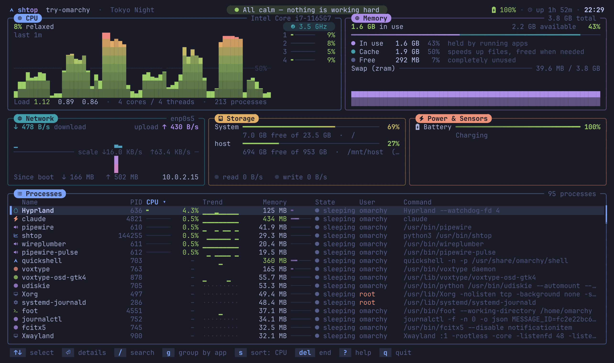
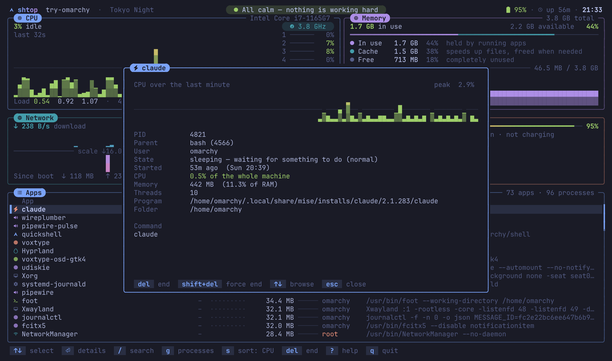
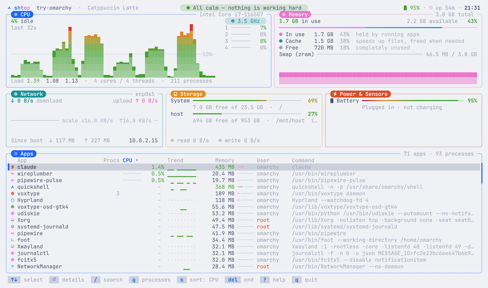

# shtop

A calm, readable system monitor for the terminal. It shows the same things as
`top`, `htop` or `btop`, but explains them: a status line tells you in plain
words how the system is doing, apps are grouped by name, and every panel
labels what its numbers mean.



It follows your [Omarchy](https://omarchy.org/) theme live as you switch
themes, and on any other Linux it uses your terminal's own colours. It's a
single Python script with no dependencies beyond Python itself.

## What you see

- **Status line:** "All calm — nothing is working hard", "Busy — mostly
  firefox (62% CPU)", "Memory is almost full — chromium holds 2.1 GB",
  "System drive is almost full". Its dot turns green, yellow or red.
- **CPU:** how busy it is in words (idle, relaxed, working, busy, maxed out),
  a scrolling history that turns redder as it gets taller, a bar per core,
  clock speed, temperature and load.
- **Memory:** split into *in use*, *cache* and *free*, each with a short
  explanation (cache is spare RAM that's handed back when needed, so it isn't
  really used), plus swap and a history graph.
- **Network:** download grows up from a middle line and upload grows down,
  with totals since boot and your local IP.
- **Storage:** how full each drive is in plain names (System, Home), free
  space, and whether anything is reading or writing right now.
- **Power & Sensors:** battery with time left ("On battery · 3h 20m left"),
  temperatures, fans and GPU usage (AMD and NVIDIA), when the hardware
  reports them.
- **Processes:** everything running, with PID, icon, a CPU trend sparkline,
  memory, state, user and command line. Press <kbd>g</kbd> to group them by
  app, so a browser with twenty processes becomes one row. CPU % is a share of
  the whole machine: 100% means every core is busy.

Press <kbd>Enter</kbd> on a process to see its CPU over the last minute, its
parent, the program, folder, start time and command line. On an app, it also
lists every process the app is made of.



Light themes work too:



## Install

**Arch Linux and Omarchy**, the package from the latest release:

```bash
sudo pacman -U https://github.com/giorgobiani/shtop/releases/download/v1.2.0/shtop-1.2.0-1-any.pkg.tar.zst
```

Remove it with `sudo pacman -R shtop`. Or build the package yourself:

```bash
git clone https://github.com/giorgobiani/shtop.git
cd shtop/packaging/arch
makepkg -si
```

An [AUR](https://aur.archlinux.org/) package (`yay -S shtop`) is on the way;
new AUR accounts are paused for now.

**Any Linux**, from source:

```bash
git clone https://github.com/giorgobiani/shtop.git
cd shtop
sudo make install             # PREFIX=/usr/local by default
```

Or copy the `shtop` file anywhere on your `PATH`. Uninstall with
`sudo make uninstall`.

### Requirements

- Linux (shtop reads `/proc` and `/sys`)
- Python 3.11 or newer
- A terminal with true colour, which almost every current terminal has
- Optional: a [Nerd Font](https://www.nerdfonts.com/) for icons. Omarchy
  ships one. Without it, shtop uses plain symbols. On Arch,
  `pacman -S ttf-nerd-fonts-symbols-mono` adds icons to any font.

## Use

```
shtop                   run it
shtop -i 1              refresh processes every second (0.5–8, default 2)
shtop -a                start grouped by app instead of one row per process
shtop --no-animation    update numbers instantly (uses less CPU)
shtop --no-icons        plain symbols, for terminals without a Nerd Font
shtop --dump 120x40     print a single frame and exit
```

| Key | Does |
|-----|------|
| <kbd>↑</kbd> <kbd>↓</kbd> or <kbd>j</kbd> <kbd>k</kbd> | Move the selection (<kbd>PgUp</kbd> <kbd>PgDn</kbd> <kbd>Home</kbd> <kbd>End</kbd> jump) |
| <kbd>Enter</kbd> or click | Details for the selected process or app |
| <kbd>/</kbd> | Search by name, command line or PID (<kbd>Esc</kbd> clears) |
| <kbd>g</kbd> | Switch between individual processes and apps (grouped by name) |
| <kbd>s</kbd> | Next sort; <kbd>c</kbd> <kbd>m</kbd> <kbd>n</kbd> <kbd>p</kbd> sort by CPU, memory, name, PID; <kbd>r</kbd> reverses. Clicking a column header sorts too |
| <kbd>Del</kbd> or <kbd>x</kbd> | End the process (or every process of the app) nicely (SIGTERM), after confirming |
| <kbd>Shift</kbd>+<kbd>Del</kbd> or <kbd>X</kbd> | Force-end it (SIGKILL), after confirming |
| <kbd>t</kbd> | Show or hide kernel tasks |
| <kbd>a</kbd> | Animations on or off |
| <kbd>+</kbd> <kbd>-</kbd> | Update faster or slower |
| <kbd>?</kbd> | A guide to every panel and key |
| <kbd>q</kbd> | Quit |

The mouse wheel scrolls the list. `man shtop` has the full reference.

## Colours

shtop uses the first of these that exists:

1. the file in `$SHTOP_THEME`
2. `~/.config/shtop/colors.toml`
3. the current Omarchy theme, followed live as you switch themes
4. your terminal's own palette, which shtop asks the terminal for at startup
5. a built-in palette (Tokyo Night)

A colours file uses the same format as an Omarchy theme's `colors.toml`. Any
key you leave out comes from the built-in palette, and shtop picks up changes
to the file while it runs:

```toml
background = "#1a1b26"
foreground = "#a9b1d6"
accent     = "#7aa2f7"   # titles, selection, keys
muted      = "#414868"   # borders and quiet text
selection  = "#292e42"   # selected row
red        = "#f7768e"
yellow     = "#e0af68"
green      = "#9ece6a"
cyan       = "#449dab"
blue       = "#7aa2f7"
magenta    = "#ad8ee6"
orange     = "#eb927b"
```

Cells without a colour of their own use the terminal's default background, so
a transparent terminal stays transparent.

## On Omarchy

To open shtop from the Activity shortcut (<kbd>Super</kbd>+<kbd>Ctrl</kbd>+<kbd>T</kbd>)
instead of btop, add this to `~/.config/hypr/bindings.lua`:

```lua
hl.unbind("SUPER + CTRL + T")
o.bind("SUPER + CTRL + T", "Activity", { tui = "shtop" })
```

## How it works

Every second shtop reads CPU, memory and network counters from `/proc`;
every two seconds (`-i`) it reads processes, drives, sensors and battery from
`/proc` and `/sys`. The screen is drawn into a buffer and only rows that
changed are sent to the terminal, inside synchronized-update markers so
nothing flickers. Numbers ease towards new values over about a quarter of a
second.

It uses about 3% of one CPU core with animations on, and about 1% with
`--no-animation`.

## Development

```bash
make test              # python -m unittest, no extra packages needed
make lint              # ruff check .
./shtop --dump 150x42  # render one frame without a terminal
```

The tests include a full session in a pseudo-terminal that answers shtop's
colour queries like a real terminal would.

## License

[MIT](LICENSE)
